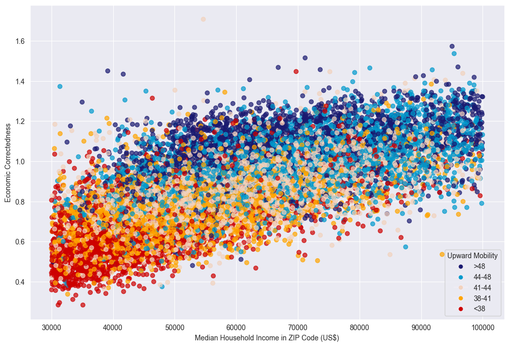

## Purpose 

This repository contains an analysis of Economic Connectedness, that was done in the context of the university course: **Applied Machine Learning**. 

## Tools and Packages 

The analysis was executed on [Jupyter](https://jupyter.org/).

## Additional packages required for the project to run are: 

* [pandas](https://pandas.pydata.org/docs/)
* [numpy](https://numpy.org/)
* [seaborn](http://seaborn.pydata.org/)
* [matplotlib](https://matplotlib.org/)
* [Plotly](https://plotly.com/python/plotly-express/)
* [plotnine-ggplot](https://pypi.org/project/plotnine/)
* [urlib](https://docs.python.org/3/library/urllib.html)
* [warnings](https://docs.python.org/3/library/warnings.html)
* [json](https://docs.python.org/3/library/json.html)
* [adjustText](https://pypi.org/project/adjustText/)
* [os](https://docs.python.org/3/library/os.html)
* [turtle/color](https://docs.python.org/3/library/turtle.html)
* [cprofile/label](https://docs.python.org/3/library/profile.html#module-cProfile)

All the packages above can be installed using the ``pip install`` command-line command.

## Data

The data used can be found in the ``data`` folder. 
    * Running the jupyter notebook, you will find detailed description-documentation.

## How to Run 

1. Clone the project: Execute the command ``https://github.com/e-panourgia/economic_connectedness_analysis_visualizations.git``
2. **Unzip** folder ``t8190130_Assignment_1st.7z``.
2. Move into the folder ``t8190130_Assignment_1st``. 
3. Run jupyter notebook named: ``Economic_Connectedness_Analysis_Visualizations.ipynb``.

---
## Generated Visualizations 
* Q1 : The Geography of Social Capital in the United States

* Q2 : Economic Connectedness and Outcomes

* Q3: Upward Income Mobility, Economic Connectedness, and Median House Income

* Q4 Friending Bias and Exposure by High School

* Q5: Friending Bias vs. Racial Diversity¶

------
*Note: The purpose behind this analysis was  to performed it in order to get comfortable with using pandas, visualizations and Jupyter Notebook.*